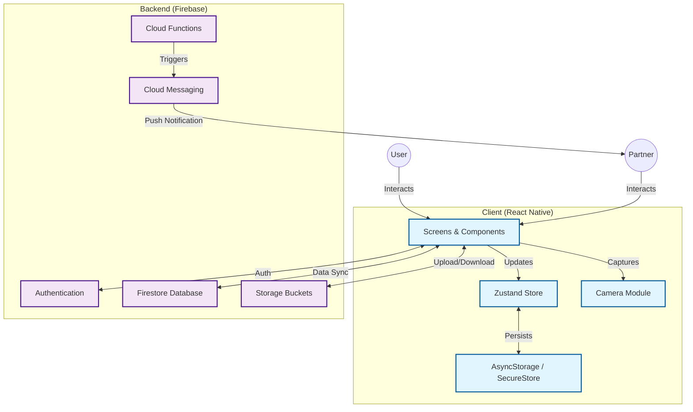

# CoupleSnap

CoupleSnap is a photo-first messaging experience built exclusively for two people. Every exchange starts with a selfie and can be enhanced with bold, draggable text overlays that feel like personal headline moments. The current prototype focuses on the capture and editing flow; the accompanying documentation outlines the planned end-to-end system spanning real-time presence, encrypted delivery, and rich push notifications.

---

## Project Overview

- **Audience:** Committed couples who prefer intentional, visual communication.
- **Core Value:** Require a photo with every message to create a shared stream of authentic snapshots.
- **Modes:** Active session (both partners in-app, WebSocket powered) and passive mode (push notification, store-and-forward).
- **Differentiators:** Photo-only messaging, couple-exclusive spaces, presence awareness, and privacy-first design.

---

## Current App Snapshot (Prototype)

- Launches straight into a minimal home screen with an `📷 Open Camera` CTA.
- `CameraScreen` (`src/screens/CameraScreen.tsx`) captures selfies, supports draggable headline text, pinch-to-resize, font selection, and enforces message + photo pairing before sending.
- `TextOverlayScreen` (`src/screens/TextOverlayScreen.tsx`) previews the captured photo, mirrors front-camera captures, and lets users fine-tune text placement/scale before saving.
- Integration with backend services, pairing flows, and messaging pipelines are specified in the docs and slated for implementation.

---

## Technical Architecture (Planned)

- **Frontend:** React Native (Expo), TypeScript, Zustand for lightweight state, React Navigation for flows, `react-native-vision-camera` / Expo Camera for capture, Reanimated + Gesture Handler for text manipulation.
- **Backend:** Firebase Auth (phone verification), Firestore for conversations & presence, Firebase Storage for encrypted photo assets, Cloud Functions for orchestration, and FCM/Notifee for notifications.
- **Security:** End-to-end encryption using RSA key exchange + AES-256-GCM payloads, strict Firestore/Storage rules, device keychains, and certificate pinning.
- **Monitoring:** Firebase Analytics, Crashlytics, perf traces, plus KPI dashboards targeting sub‑3s send flows and <0.5% crash rate.

### High-Level Architecture Diagram



See `docs/System_Arch_.v1.md` for mode diagrams and `docs/couplesnap-tech-doc.md` for full system, data, and roadmap details.

---

## Feature Roadmap Highlights

- **MVP:** Camera-first UX, encrypted photo messaging, rich push notifications, partner pairing, read receipts, and presence.
- **Enhancements:** Shared albums, quick reactions, streak tracking, daily prompts, and ephemeral modes.
- **Future:** Video clips, voice notes, AR filters, scheduling, web/tablet/watch clients, AI-powered memories, and premium tiers.

Detailed sequencing and priority matrices live in `docs/couplesnap-tech-doc.md`.

---

## Getting Started

### Prerequisites

- Node.js 18+
- npm 9+ (ships with Node 18) or compatible package manager
- Expo CLI (`npm install --global expo-cli`)
- iOS Simulator (Xcode) or Android Emulator / physical device with Expo Go

### Installation

```bash
npm install
```

### Running in Development

```bash
# Start the Expo dev server (Metro)
npm run start

# Convenience scripts
npm run ios     # launch iOS simulator via Expo
npm run android # launch Android emulator via Expo
npm run web     # run Expo web preview
```

Expo DevTools will provide QR codes for launching the experience on devices. The prototype flow persists only locally; backend-dependent features are stubbed out until Firebase wiring is complete.

---

## Project Structure (Active Directories)

```
CoupleSnap/
├── App.tsx                # Entry point orchestrating screen flow
├── src/
│   └── screens/
│       ├── CameraScreen.tsx      # Photo capture + live text overlay gestures
│       └── TextOverlayScreen.tsx # Post-capture editing & confirmation
├── assets/                # App icons, splash assets
└── docs/                  # Architecture, tech specs, diagrams, setup scripts
```

Future iterations (per docs) will introduce `components/`, `services/`, `store/`, `hooks/`, and navigation scaffolding.

---

## Environment & Deployment Notes

- `create_presentation.py` and `docs/setup.sh` provide utility automation for onboarding/documentation.
- Environment files (`.env.development`, `.env.staging`, `.env.production`) will supply Firebase and feature flag configuration once backend integration begins.
- Planned CI/CD pipelines target GitHub Actions with automated tests, Expo builds, and Firebase deployments (see `docs/couplesnap-tech-doc.md` for workflow YAML).

---

## Testing Strategy (Planned)

- **Unit & Integration:** Jest + React Testing Library + Firebase emulators to cover services, hooks, and core UI interactions.
- **E2E:** Detox for iOS/Android device automation focusing on onboarding, photo messaging, and offline synchronization.
- **Performance & Security:** React Native performance monitor, OWASP ZAP, and MobSF during pre-release hardening.

---

## Documentation & References

- `docs/couplesnap-tech-doc.md` – comprehensive technical specification, APIs, data models, security posture, performance targets, and roadmap.
- `docs/System_Arch_.v1.md` – high-level architecture diagrams, mode breakdowns, and user journey scenarios.
- `docs/ActivityFlow.png`, `notificationExchange.png`, `realTimeExchange.drawio.png` – visual flows for onboarding, notifications, and real-time messaging.

Keep these sources up to date as implementation matures; the README should remain a concise gateway, while the docs folder carries deep dives.

---

## Contributing

1. Review the technical spec (`docs/couplesnap-tech-doc.md`) for context and agreed conventions.
2. Align features with the priority matrix before opening a branch.
3. Use TypeScript, follow planned directory conventions, and write or update tests alongside features.
4. Coordinate environment changes (Firebase, feature flags) through shared secrets management.

---

CoupleSnap aims to turn everyday check-ins into a ritual of shared visuals. Contributions that preserve intimacy, reliability, and privacy are especially welcome. 💑📸


